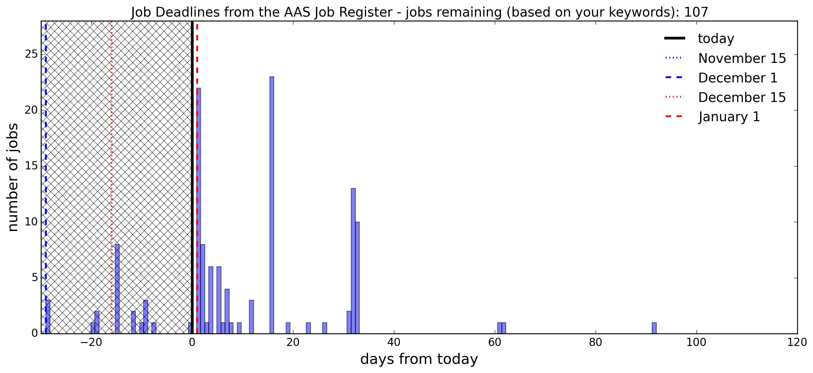
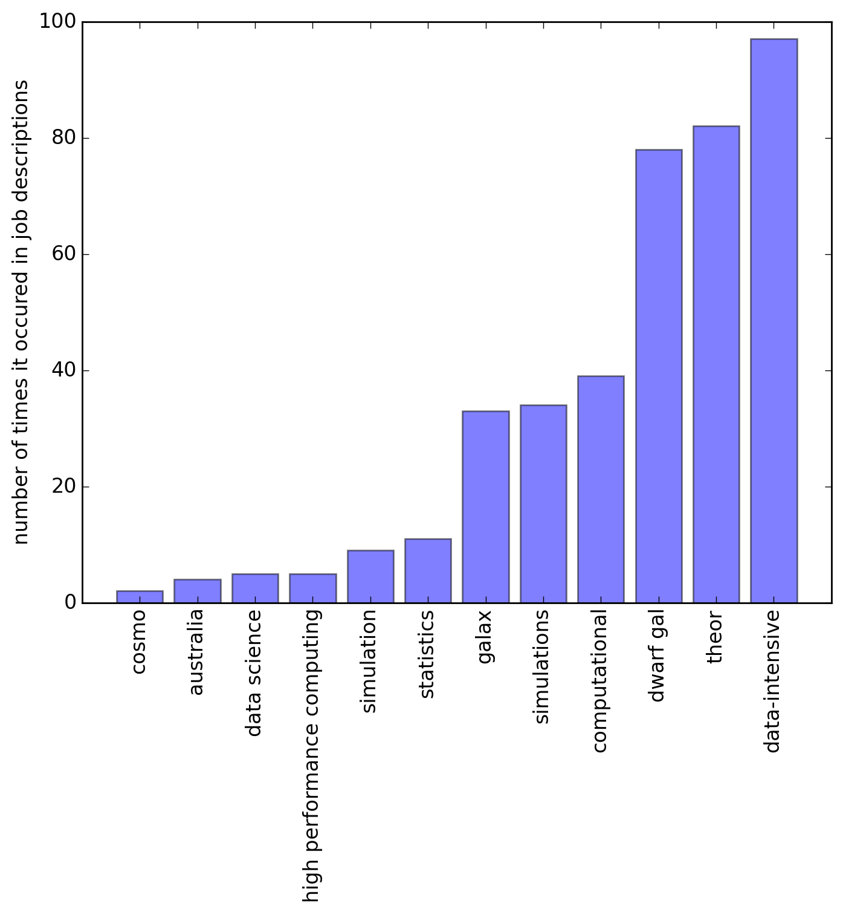

Most of the job hunting season is behind us and for many astronomers, firm decisions about the direction of our careers and lives have been set in motion. For the uninitiated, every Fall (northern hemisphere) astronomers facing the end of their contracts (whether that be as a PhD student, postdoc or research scientist) head to the dreaded [ADS Job Register](https://jobregister.aas.org/) to see what possible future awaits them (assuming they decide to stay in the field).

I don't know about how my other colleagues feel about this site but I think it is extremely hard to get your desired information. You have to scroll through all the job links and open up separate tabs to determine if jobs titled "postdoc in cosmology" is for you. Then many of us compile a spreadsheet of the possible options with various due dates and contact emails to actually apply for. Then you also have to do this each month as some fellowships and postdoctoral positions are only announced at particular times. This becomes extremely tedious and only compounds the mental anguish of actually having to intellectually prostitute oneself in the best possible fashion in the hope of being one of the diminishing few to obtain a position.

I wanted to make this process easier so I coded up [Easy AAS Jobs](https://github.com/bgriffen/easyaasjobs). It is a small piece of code based on some other scraping code by [Gully](https://github.com/gully). 

In order to get the code working, here are some instructions:

1. Select the career options you would like to query.
2. Select your display options. Note: it is best to just do a full query on your keywords first, then from the in-browser table, select `jobids` (1st column) which are of interest to you. Add those job ids to the job_ids_filter below.
3. Re-run code with your `jobids` selected and create your deadline plot.

```python
# career options
# select which jobs you would like
WANT_FACULTY_JOBS = False
WANT_POSTDOC_JOB = True
WANT_PHD = False
WANT_ENGINEERING_OR_TECHSTAFF_JOB = False
WANT_MANAGEMENT_JOBS = False
WANT_OTHER_JOBS = False

# display/output options
WANT_JOBS_PAST_DEADLINE = False  # do you want jobs past the deadline?
OPEN_RESULTS_IN_BROWSER = True   # do you want a query table in browser?
WANT_DEADLINE_PLOT = True        # do you want a time line made?
SELECT_OVER_KEYWORDS = True      # do you want to only include the keywords (in descriptions) selected below?
FILTER_OVER_JOB_ID = False       # do you want only specific job ids (best to set once you've queried the keyword selected jobs)
PLOT_KEYWORD_HIST = True         # do you want a histogram of the keywords?

# select your filtered job ids
if FILTER_OVER_JOB_ID: job_ids_filter = [51388,51391,51554,51591,51624]

# select your keywords
keywords = ['theor', 'data-intensive', 'computational', 
            'galax','data science','statistics','simulations', 
            'high performance computing']
```

To run: 

```bash
> python getastrojobs.py
```

Let it compile the data products first, then re-run for analysis. Here are some examples of the types of figures one can make.

## Deadlines specific to your jobs
  

## Display All Your Jobs In One Table (In Browser)
I've found this table particularly useful for deciding if a particular job on offer was of interest (note the announcement details). I also added in a `days_left` column which tells you how to prioritize applications (i.e. days remaining until due). 


## Keyword Histograms
This is more a curiosity than an actual practical plot. It just gives you an idea of the most popular job announcements given a set of keywords.


It might be a little late in the game to be publishing this but perhaps it might be of use to people for the following year. Good luck!